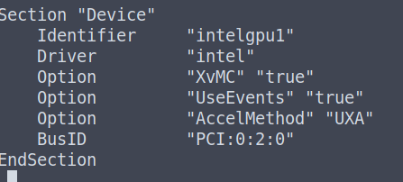

# 2 monitores no Parrot OS e sistemas baseados em Debian

Informações aonde foi realizado o teste:

- Notebook Lenovo Ideapad l340
- CPU i5-9300H
- GPU Intel CoffeeLake-H [UHD Graphics 630]
- GPU NVIDIA GeForce GTX 1050
- Parrot OS 5.1 (Electro Ara)

## Instalar drivers nvidia

Se você estiver usando usando o parrotOS versão 5.1 (Electro Ara) adiante, pode pular para etapa 3. Caso contrário siga os passos, sembrando que aqui é para sistemas baseados em debian.

1. Reinicie o computador, no grub precione a tecla E.
    - Temos que desativar os modulos nouveau, para que não subam para o SO quando ligarmos.

2. Navegue até a linha que começa com Linux e vá até o final da linha aonde está escrito ***quiet splash*** e subistitua-o por ***nouveau.modeset=0***

3. Se seu Parrot estiver abaixo da versão 5.1, atualize-o seguindo as etapas abaixo, mas se não quiser atualizar, desconsidere essa etapa. Mas se tiver confiança pelo menos atualize os repositórios e os pacotes com ***sudo apt update*** e ***sudo apt upgrade***.
    1. ***sudo apt update***
    2. ***sudo apt install parrot-core***
    3. ***sudo parrot-upgrade***

4. ***sudo apt install linux-headers-$(uname -r)***
    - Confira se os headers da distro linux usada esta na mesma versão que o do seu kernel.

5. Bloqueie a inicialização do modulo nouveau, para que quando você instalar os modulos da nvidia, esses dois rapazes não entrem em conflito. ***echo -e "blacklist nouveau\noptions nouveau modeset=0\nalias nouveau off" > /etc/modprobe.d/blacklist-nouveau.conf***

6. ***update-initramfs -u***
    - Atualize as mudanças de inicialização feita na etapa 5.

7. ***reboot***
    - reinicie o PC

8. Confira se os modulos da nouveau não foram iniciados realmente com ***lsmod | grep -i nouveau***, se aparecer algum resultado é porque eles foram iniciados (Deu algo errado), volte na etapa 5 e confira se tem algo de errado.

9. ***apt install nvidia-driver***
    - Instale os drivers nvidia do próprio repositório de sua distro...

10. ***apt install nvidia-smi***

11. ***apt install bumblebee-nvidia***

12. ***apt install primus-nvidia***

## Configurar o bumblebee

O bumblebee é um alternativo ao pacote da nvidia-xconfig.

1. ***sudo nano /etc/bumblebee/bumblebee.conf***
    - Com seu editor de texto abra esse arquivo acima, no caso usei o nano.

2. Procure a palavra ***Driver=*** e dicione ***Driver=nvidia***, depois procure por ***KernelDriver=*** e adicione ***KernelDriver=nvidia-current***.
    - Uma observação é que o ***nvidia-current*** é a versão mais atual quando instalamos o ***nvidia-driver***, se você tiver instalado uma outra versão diferente da atual você tem que especifica-la, EX: ***nvidia-470***.

3. Salve o arquivo.

4. ***sudo nano /etc/X11/xorg.conf***

5. copie o conteudo desse link <https://github.com/Pedrobolfute/2-monitors-ParrotOS/blob/main/archives/xorg.conf> e cole no xorg.conf. Salve o arquivo.
    - Você vai precisar mudar o BusID conforme o seu computador. Para verificar qual é o seu use o comando lspci: ***lspci | grep -i vga***. Mas mantenha a estrutura (decimal) do arquivo. EX:
    - 
    - 
    - 

6. ***sudo nano /etc/X11/xorg.conf.d/20-intel.conf***

7. Copie o conteudo desse link <https://github.com/Pedrobolfute/2-monitors-ParrotOS/blob/main/archives/20-intel.conf> e cole no arquivo 20-intel.conf. Salve o arquivo.

8. ***sudo nano /etc/bumblebee/xorg.conf.nvidia***

9. Copie o conteudo desse link <https://github.com/Pedrobolfute/2-monitors-ParrotOS/blob/main/archives/xorg.conf.nvidia> e cole no arquivo xorg.conf.nvidia. Salve o arquivo.

10. Reinicie o computador

11. Agora conecte o cabo HDMI.

12. Agora digite o comando no terminal ***optirun intel-virtual-output***
    - Se tiver dado certo coloque esse comando como alguma tecla de atalho, se preferir...
    - Agora se você ir em monitores o seu segundo monitor vai aparecer la e então você pode fazer as alterações por la mesmo. Como redimensionar a tela, trocar a posição do monitor e mudar frequencia.