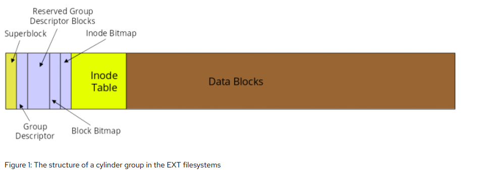

# Sistema de arquivo EXT4

É a quarta versão do sistema de arquivos EXT, que era usado no Minix, o Sistema Operacional de Tanembaum. Como era de código livre, ele foi aproveitado e implementado por Linus o criador do Linux. Então com o tempo ele foi modificado e melhorado.

- Umas de suas funcionalidades são:

  - Ele é mais ultilizado no linux e suporta muitos outros sistemas de arquivos, como NTFS do windows e FAT32 do pendrive, suas versões anteriores (EXT, EXT2, EXT3) e entre muitos outros.
  - Mais ultilizado por padrão, por sua estabilidade ao manter o dado/informação concervado por bastante tempo.
  - A versão EXT4 tem e usa o mecanismo Journal, que é como um diário que mantém informações das mudaças dos dados que não foram empacotados. Assim permitindo uma restauração de dados/informações mais rápido caso haja algum problema como:
    - "O computador desligou inesperadamente! No momento das atualizações do sistema"
      - Mas após ligar o PC acontece uma checagem e os dados de algum jeito estão lá (Imcompletos ou não). Thanks Journalig!
