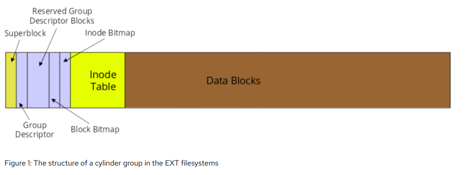
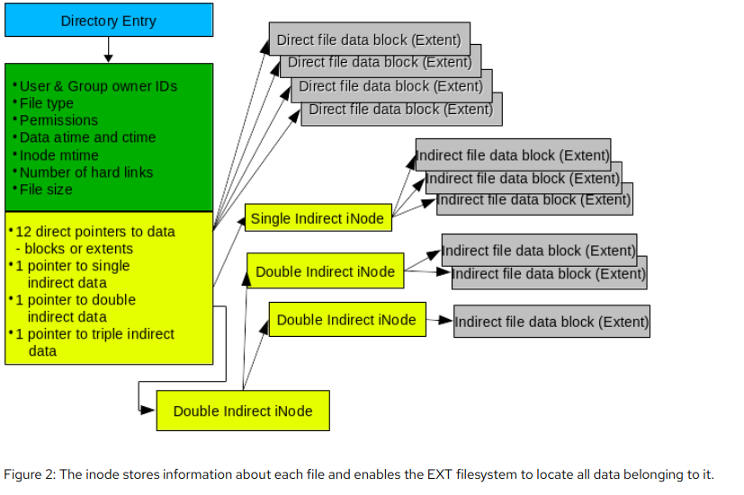

# Sistema de arquivo

- Define a estrutura.
  - O Sistema de arquivos é uma estrutura que vai conter algorítimos para resolver e gerenciar problemas. Pode-se encontrar vários tipos de sistemas arquivos como NTFS, FAT32 e entre outros (Windows usa NTFS e pendrive geralmente usa FAT32).
- Gerencia a forma de como os arquivos vão se comportar.
  - Pense o seguinte: para resolver um problema falamos muito em algorítimo (sequencia de passos para resolver o problema). Dito isso, cada bloco desse sistema de arquivo vai conter algúm código referenciando algo, como:
    - Aonde o dado vai ser guardado no HD/SSD físico?
    - Qual o espaço de bytes ele vai ocupar no HD/SSD?
    - Qual o nome?
    - Metadados?
    - Inode?
    - ...

- Dependendo do sistema de arquivo, algumas informações acima podem ser trocadas de lugar nos blocos e/ou não existir.
- Cada sistema de arquivo tem suas funções voltadas para atender determinado público.

***

***
***

## Referencias:

- https://opensource.com/article/17/5/introduction-ext4-filesystem
- https://en.wikipedia.org/wiki/Journaling_file_system
- https://www.easeus.com/resource/btrfs-vs-ext4.html#:~:text=Ext4%20(Extended%20File%20System),a%20max%20of%20232%20files.